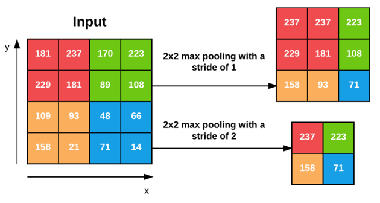
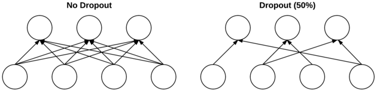
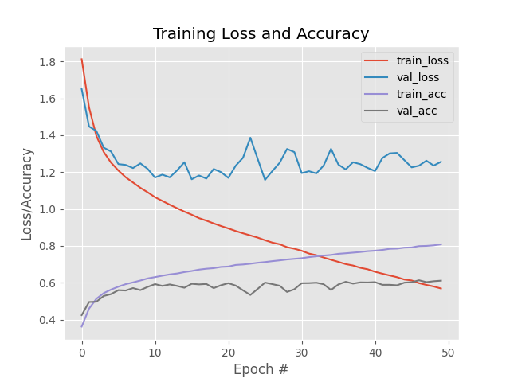

# Simple-CNN-using-Keras-and-Tensorflow
In this project we build a single conv neural network and show the results, and a brief summary of the CNN layer types / options.
We send the Cifar 10 dataset through the network and examine the results.

## Description

Before we get into the datasets and their results, let's cover the possible CNN layers we may encounter when building / training
our CNN. Although we are only using CONV in this project, there are out options:
1. **Convolutional (CONV)**
2. **Activation (ACT or RELU)**
3. **Pooling (POOL)**
4. **Fully connected (FC)**
5. **Batch normalization**
6. **Dropout (DO)**

Stacking a series of these layers in a specific manner yields a CNN. Of these layer types, CONV and FC (and to a lesser extent, BN) 
are the only layers that contain parameters that are learned during the training process.

A good overview of these layers can be found at:  
https://pyimagesearch.com/2021/05/14/convolutional-neural-networks-cnns-and-layer-types/?_ga=2.173667171.1119707357.1647809282-1931257770.1641919015

But below is a quick summary.

### Convolutional Layers
The CONV layer is the core building block of a Convolutional Neural Network. The CONV layer parameters consist of a set of K
learnable filters (i.e., “kernels”), where each filter has a width and a height, and are nearly always square. These filters
are small (in terms of their spatial dimensions) but extend throughout the full depth of the volume.

For example, if our input volume has an input size of 32×32×3. Each image thus has a width of 32 pixels, a height of 32 pixels, and a depth of
3 (one for each RGB channel). If our receptive field is of size 3×3, then each neuron in the CONV layer will connect to a 3×3
local region of the image for a total of 3×3×3 = 27 weights (remember, the depth of the filters is three because they extend through
the full depth of the input image, in this case, three channels).

### Activation Layers
After each CONV layer in a CNN, we apply a nonlinear activation function, such as ReLU, ELU, or any of the other Leaky ReLU variants.
Activation layers are not technically “layers” (due to the fact that no parameters/weights are learned inside an activation layer).

### Pooling Layers
The primary function of the POOL layer is to progressively reduce the spatial size (i.e., width and height) of the input volume.
Doing this allows us to reduce the amount of parameters and computation in the network — pooling also helps us control overfitting.

An example of Pooling (from [Pyimagesearch](https://pyimagesearch.com/2021/05/14/convolutional-neural-networks-cnns-and-layer-types/?_ga=2.173667171.1119707357.1647809282-1931257770.1641919015)):  



### Fully connected Layers
Neurons in FC layers are fully connected to all activations in the previous layer, as is the standard for feedforward neural networks. 
FC layers are always placed at the end of the network (i.e., we don’t apply a CONV layer, then an FC layer, followed by another CONV) layer.
It’s common to use one or two FC layers prior to applying the softmax classifier.

### Batch Normalization
Batch normalization has been shown to be extremely effective at reducing the number of epochs it takes to train a neural network.
Batch normalization also has the added benefit of helping “stabilize” training, allowing for a larger variety of learning rates and regularization strengths.

### Dropout
Dropout is a form of regularization that aims to help prevent overfitting by increasing testing accuracy, perhaps
at the expense of training accuracy. For each mini-batch in our training set, dropout layers, with probability p, randomly
disconnect inputs from the preceding layer to the next layer in the network architecture.

An example of Dropout (from [Pyimagesearch](https://pyimagesearch.com/2021/05/14/convolutional-neural-networks-cnns-and-layer-types/?_ga=2.173667171.1119707357.1647809282-1931257770.1641919015)):  



## SimpleNet

As stated above, the SimpleNet model uses only one convolutional layer.
The code for this model can be found in 'scripts/fundamentals/neuralnet/simple_net.py' and is essentially created in Keras
with these lines of code:

The entire model architecture can be summarized as:  
**INPUT => CONV => RELU => FC**

```buildoutcfg
    model.add(Conv2D(32, (3, 3), padding="same",
        input_shape=input_shape))
    # Add relu activation
    model.add(Activation("relu"))
    
    # Add softmax for classification
    # Need to flatten and add dense (FC) layer prior
    model.add(Flatten())
    model.add(Dense(classes))
    model.add(Activation("softmax"))
```

## Results

### CIFAR-10 Dataset
Code can be found in 'scripts/cifar10_example_keras.py'.  

For this dataset we use a 3072-1024-512-10 architecture with 50 epochs and a learning
rate (SGD) of 0.01.

The results summary can be seen below:
```buildoutcfg
              precision    recall  f1-score   support

    airplane       0.61      0.71      0.66      1000
  automobile       0.75      0.72      0.73      1000
        bird       0.50      0.39      0.44      1000
         cat       0.37      0.50      0.42      1000
        deer       0.67      0.36      0.47      1000
         dog       0.44      0.58      0.50      1000
        frog       0.81      0.59      0.68      1000
       horse       0.56      0.76      0.64      1000
        ship       0.78      0.69      0.73      1000
       truck       0.72      0.67      0.70      1000

    accuracy                           0.60     10000
   macro avg       0.62      0.60      0.60     10000
weighted avg       0.62      0.60      0.60     10000
```

The training loss and accuracy plot for both the training and validation 
datasets can be seen below:



We see by examining the plot of loss and accuracy that we
struggle with overfitting after the initial few epochs. Although loss initially decreases, after about epoch 5 the accuracy remains 
the same all while our training loss consistently decreases. This is a good example of model overfitting.  

So what do we do if our basic CNNs not performing for our dataset? We'll have to add more layers (obviously)
and increase our model generalization by adding regularization (Possibly Batch normalization or Dropout layers). 

## Getting Started

### Dependencies

See requirements.txt

### Installing

#### Clone the project:
```
git clone git@github.com:reedajohns/Simple-CNN-using-Keras-and-Tensorflow.git
```

### Executing program

Open terminal and run either command:
```
python cifar10_simple_cnn.py --output ../media/keras_simple_cnn_cifar10.png --model ../models/simpleet_weights.hdf5
```

## Authors

Contributors names and contact info

Reed Johnson (https://www.linkedin.com/in/reed-a-johnson/)

## Version History

* 0.1
    * Initial Release

## License

This project is licensed under the GNU GENERAL PUBLIC License - see the LICENSE.md file for details

## Acknowledgments

Inspiration, code snippets, etc.
* [Pyimagesearch](https://pyimagesearch.com/2021/05/22/a-gentle-guide-to-training-your-first-cnn-with-keras-and-tensorflow/?_ga=2.248616903.1119707357.1647809282-1931257770.1641919015)